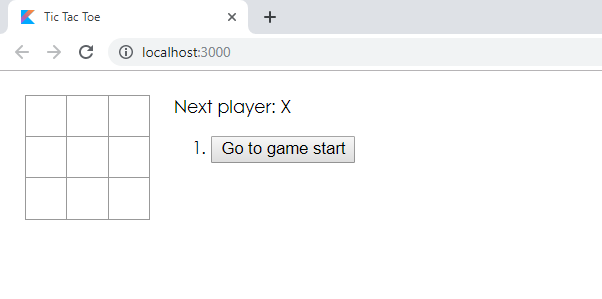

# Tic Tac Toe

The project is designed to show that you can implement your own Kotlin-React projects using just with React tutorials.

youtube : https://www.youtube.com/playlist?list=PLT2xIm2X7W7h3GNbKSVZM24NEx59wmWHP

<div style="display: flex;">
	  
</div>

Below you will find some useful information on how to work with this application.<br>
This application all developed with the [React Original Tutorial](https://reactjs.org/tutorial/tutorial.html)!

## Folder Structure

after setup your project should look like this:

```
tic-toc-toe/
  README.md
  node_modules/
  package.json
  .gitignore
  public/
    favicon.ico
    index.html
    manifest.json
  src/
    board/
      Board.css
      Board.kt
    game/
      Game.css
      Game.kt
    index/
      index.css
      index.kt
    square/
      Square.css
      Square.kt
```

For the project to build, **these files must exist with exact filenames**:

* `public/index.html` is the page template;

You can delete or rename the other files.

You may create subdirectories inside `src`. For faster rebuilds, only files inside `src` are processed by Webpack.<br>
You need to **put any Kotlin and CSS files inside `src`**, or Webpack won’t see them.

Only files inside `public` can be used from `public/index.html`.<br>
Read instructions below for using assets from JavaScript and HTML.

You can, however, create more top-level directories.<br>
They will not be included in the production build so you can use them for things like documentation.

## Available Scripts

Once the installation is done, you can run some commands inside the project folder:

### `npm start` or `yarn start`

Runs the game in development mode.<br>
Open [http://localhost:3000](http://localhost:3000) to view it in the browser.

The page will reload automatically when you make edits.<br>
You will see build errors and lint warnings in the console.

### `npm run build` or `yarn build`

Builds the game for production to the `build` folder.<br>
It ensures that React is bundled in production mode and the build is optimized for best performance.

The build is minified and the filenames include hashes for cache management. Your game is ready to be deployed.

### `npm run eject`

**Note: this is a one-way operation. Once you `eject`, you can’t go back!**

If you aren’t satisfied with the build tool and configuration choices, you can `eject` at any time. This command will remove the single build dependency from your project.

Running `npm run eject` copies all configuration files and transitive dependencies (webpack, Kotlin Compiler, etc) right into your project so you have full control over them. Commands like `npm start` and `npm run build` will still work, but they will point to the copied scripts so you can tweak them. At this point, you’re on your own.

## Debugging the App

You can debug the running game right in IntelliJ IDEA Ultimate using its built-in JavaScript debugger. The IDE will run a new instance of Chrome and attach a debugger to it.

Start your game by running `npm start`. Put the breakpoints in your Kotlin code.
Then select `Debug in Chrome` from the list of run/debug configurations on the top-right and click the green debug icon or press `^D` on macOS or `F9` on Windows and Linux to start debugging.

Currently, debugging is supported only in IntelliJ IDEA Ultimate 2017.3+

You can also debug your application using the developer tools in your browser.

